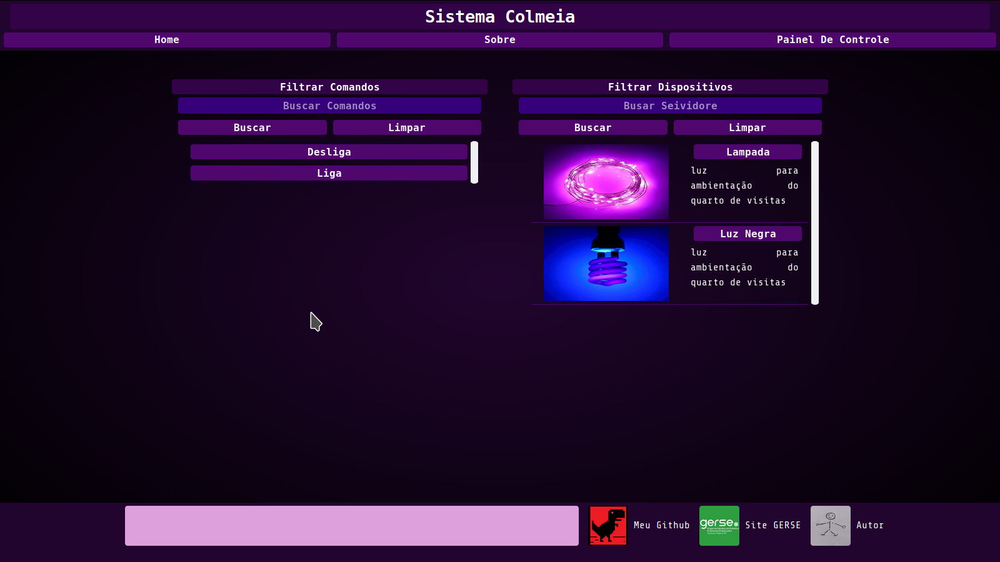
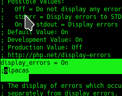
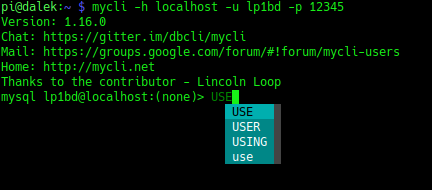

# Projeto Colmeia

Copyright (C) Pedro Igor B. S 2019 Arquivos: all

Autores: Pedro Igor Borçatti da Silva

Licença: GNU GPL 2

This program is free software; you can redistribute it and/or modify it under the terms of the GNU General Public License as published by the Free Software Foundation; version 2 of the License.

This program is distributed in the hope that it will be useful, but WITHOUT ANY WARRANTY; without even the implied warranty of MERCHANTABILITY or FITNESS FOR A PARTICULAR PURPOSE. See the GNU General Public License for more details.

---

## **Resumo**


O projeto a seguir apresenta o que seria a 2ª etapa do projeto [RaspWebClt
](https://github.com/pedro-ibs/RaspWebClt), que é  um trabalho acadêmico da disciplina de Linguagem de Programação 1 (LP1) ofertada no 2º módulo do curso de Análise e Desenvolvimento de Sistemas do Instituto Federal de Ciência e Tecnologia ([IFSP – Campus Guarulhos](http://portal.ifspguarulhos.edu.br/)). Na etapa anterior eu, decidi fugir um pouco do tema do cenário comum da disciplina e desenvolver algo mais aplicado a sistemas embarcados, com o desenvolvimento de um servidor web para controle dos GPIOs de uma Raspberry Pi. No entanto essa etapa está focada no php, css, html e banco de dados, além disso tem a temática focada no controle de dispositivos e sistemas embarcados embora não tenha integração real com esses dispositivos ou com o *GPIO* da *Raspberry*. Futuramente pretendo tornar essa integração real.



Raspberry utilizada e Preparando ambiente.
No desenvolvimento eu utilizei a Raspberry Pi modelo B+, no entanto há compatibilidade com todos o outros modelos. Para preparar o ambiente temos que obter uma versão do  [Raspbian Lite](https://www.raspberrypi.org/downloads/raspbian/), não é necessario utilizar interface gráfica por conta disso o Raspbian Lite é o ideal.

Com a imagem em mãos grave-a em um cartão sd de no mínimo 4Gb, utilize o comando fdisk para detectar o ponto de montagem e para gravar utilize o comando dd:

```
sudo fdisk -l
```
```
sudo dd if=2019-04-08-raspbian-stretch-lite.img of=/dev/mmcblk0
```

Configure sua porta ethernet para “Compartilhar com outros computadores”, com a Raspberry devidamente  ligada e conectada utilize o comando nmap para descobrir seu IP

```
nmap -sn 10.42.0.1/24
```
No lugar de 10.42.0.1 coloque o ip corespondente de sua interface de rede e em /24 a máscara de rede respectiva, após descobrir o ip conecte se via ssh o usuário padrão é senha padrão são  pi e raspberry

```
ssh pi@10.42.0.119
```

Antes de prosseguir,  com o comando raspi-config configure a raspberry de acordo com suas necessidades caso tenha dúvida procure saber sobre essas configurações no google há pontos importantes nelas
 
```
sudo raspi-config
```
Após a configuração podemos instalar todas as dependências necessárias para o funcionamento do projeto, então siga a sequência de comando:

```
sudo apt update
sudo apt upgrade
sudo rpi-update
sudo reboot - h now
```

As seguintes dependências são necessárias para o funcionamento do servidor e da página web:


```
sudo apt install apache2 -y
sudo apt install php libapache2-mod-php -y
sudo apt install python -y
sudo apt install python3 -y
sudo apt install git -y
sudo apt install mariadb-server -y
sudo apt install mysql-client -y
sudo apt install mycli -y
sudo apt install php-mysql -y
```
## **Configurações do PHP (Mostra de Erros)**

Primeiro vamos ativar as mensagens de erro do php que por padrão vem desativado, isso por questões de segurança visto que com as informações do erro pode-se explorar mais facilmente uma fala e ou vulnerabilidade,como estou usando a raspberry pare desenvolver no momento ativei as respostas de erro direto no php.ini (**NUCA FAÇA ISSO EM UM AMBIENTE DE PRODUÇÃO**, há outras formas de se fazer a mesma configuração). no arquivo **php.ini**  localizado em **/etc/php/7.3/apache2/php.ini** temos que alterar:


```
display_errors = Off
para 
display_errors = On 
```



a linha **;alpacas** é só um recurso para que eu ache a linha que editei mais facilmente com a ferramenta de pesquisa do editor de texto, logo ela não é necessária.

## **Configurando Banco de Dados**
 
Agora temos que criar a **base de dados** um **usuário** e dar os **privilégios** a esse usuário para que o mesmo possa ler e escrever na base de dados. no primeiro acesso vamos utilizar o terminal **mysql**:
 
```
sudo mysql -uroot -hlocalhost -p
```
No meu caso a senha estava vazia então apenas apertei **ENTER**, agora no terminal do mycql crio a base de dado **COLMEIA**, usuário **lp1bd** e configuro os privilégios do **lp1bd**:
 
```
CREATE DATABASE COLMEIA;
CREATE USER 'lp1bd'@'localhost' IDENTIFIED BY '12345';
GRANT ALL PRIVILEGES ON COLMEIA.* TO 'lp1bd'@'localhost';
FLUSH PRIVILEGES;
quit
```

agora utilizo o **mycli** ele é um terminal mais produtivo pois tem algun recursos interessantes como o autocompletar inteligente.



Após selecionar a base de dado **COLMEIA**, crio a tabela **DEVICE** e **COMANDO**, ela farão parte da página web (para adicionar elementos pode-se usar a própria página.)

```
mycli -h localhost -u lp1bd -p 12345
```

```
USE COLMEIA;

CREATE TABLE DEVICE( ID NUMERIC(4, 0) NOT NULL, NOME CHAR(25), DESCRICAO CHAR(50),  IMG VARCHAR(1024), PRIMARY KEY (ID));

CREATE TABLE COMANDO( ID NUMERIC(4, 0) NOT NULL, CMD CHAR(25) NOT NULL, DESCRICAO CHAR(50), PRIMARY KEY (ID));

QUIT;
```
